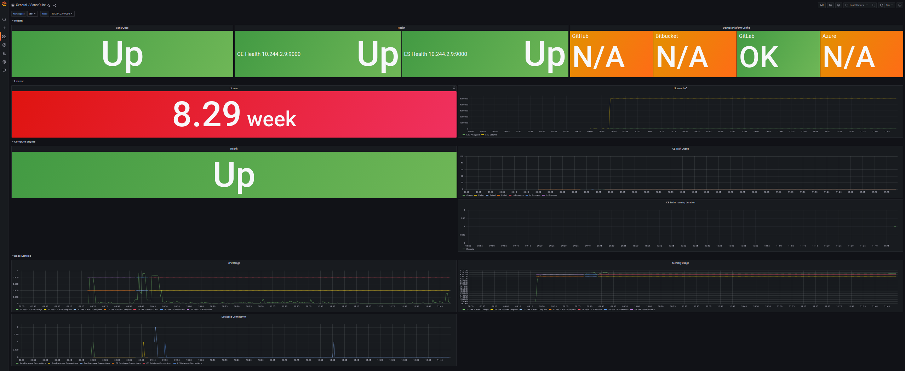
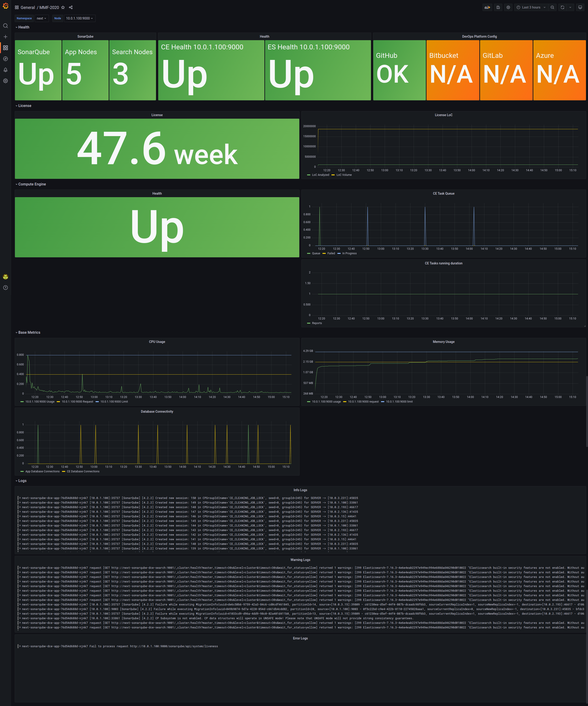

# Example Dashboards



These two dashboards should get you started with monitoring SonarQube with Prometheus. 

The [first Dashboard](sonarqube-dashboard.json) focuses only on metrics. While this will already allow to get an overview about what's going on in your instance there is a [second dashboard](sonarqube-loki-dashboard.json) adds Logs to the dashboard if json logging is enabled for SonarQube and Loki is connected to the Grafana instance to access them.

## Pod Monitor

in order to access the metrics on `/api/monitoring/metrics` you need to provide a bearer token in the same namespace as your prometheus instance. This token should hold the same value as the value for `monitoringPasscode`.  

```yaml
apiVersion: monitoring.coreos.com/v1
kind: PodMonitor
metadata:
  name: sonarqube
  namespace: monitoring
spec:
  namespaceSelector:
    matchNames:
    - sonarqube
  podMetricsEndpoints:
  - interval: 30s
    path: /
    scheme: http
    targetPort: monitoring-ce
  - interval: 30s
    path: /
    scheme: http
    targetPort: monitoring-web
  - targetPort: "http"
    interval: "30s"
    path: "/api/monitoring/metrics"
    scheme: "http"
    bearerTokenSecret:
      name: "bearer-token"
      key: "token"
  selector:
    matchLabels:
      app: sonarqube

```

# Datacenter Edition

For the Datacenter Edition a [dedicated dashboard](sonarqube-dce-dashboard.json) can be used. The main difference here is the separation in between the Application and Search Nodes to be displayed.
The PodMonitor remains the same for all editions.

